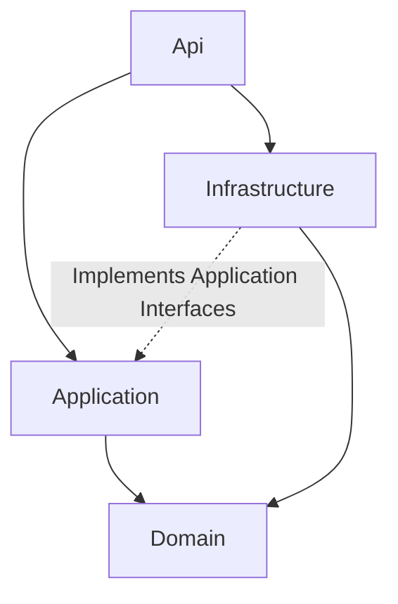
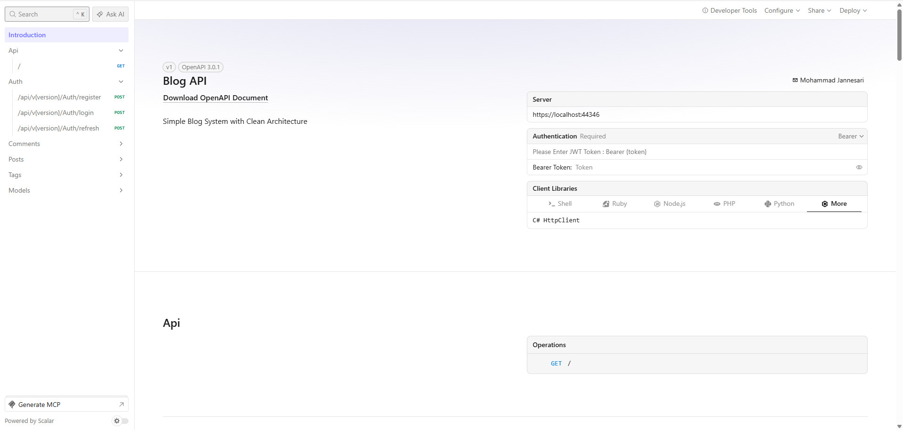

# 📝 Blog API - Clean Architecture Sample


A simple yet professional **Blog System** built with **ASP.NET Core 9** following **Clean Architecture** principles.

This project is designed as a **learning reference** that demonstrates modern backend development practices while keeping the codebase easy to understand.

> **Note**
>
> This is intentionally a simplified sample project.
>
> - CQRS Commands & Queries are used directly as API DTOs (no separate DTO layer)
> - Serilog and Health Checks are intentionally omitted to keep the focus on architecture
> - The goal is educational value rather than production readiness

---

# 📑 Table of Contents

- [Why this project?](#-why-this-project)
- [Architecture](#-architecture)
- [Request Flow](#-request-flow)
- [Project Structure](#-project-structure)
- [Technologies](#-technologies)
- [Features](#-features)
- [API Documentation](#-api-documentation)
- [Domain Layer](#-domain-layer)
- [CQRS Operations](#-cqrs-operations)
- [Getting Started](#-getting-started)
- [Security Features](#-security-features-in-detail)
- [Learning Outcomes](#-learning-outcomes)
- [License](#-license)

---

# 🎯 Why this project?

This project was built to demonstrate how a medium-sized ASP.NET Core application can be organized using **Clean Architecture** without introducing unnecessary complexity.

The focus is on:

- Separation of concerns
- Maintainable architecture
- Modern backend development practices
- Secure API design
- Readable and extensible code
- Practical implementation of common design patterns

It is intended to serve as a reference project for developers learning ASP.NET Core and Clean Architecture.

---

# 🏗️ Architecture



---

# 🛠 Technologies

| Layer | Technologies |
|--------|--------------|
| API | ASP.NET Core 9, Scalar, API Versioning |
| Application | MediatR, FluentValidation |
| Infrastructure | Entity Framework Core, SQL Server, JWT Authentication |
| Development | Docker, Docker Compose |

---

# ✨ Features

| Category | Features |
|-----------|----------|
| 🔐 Security | JWT Authentication, Refresh Token Rotation, Rate Limiting, CORS, Security Headers, HTTPS |
| 🧱 Architecture | Clean Architecture, CQRS, Repository Pattern, Unit of Work, Result Pattern, Factory Method |
| ✅ Validation | FluentValidation, Pipeline Behaviors, Value Object Validation |
| 🗄 Persistence | Entity Framework Core, SQL Server, Soft Delete, Owned Types, Global Query Filters |
| 📡 API | Scalar Documentation, API Versioning, Pagination, Exception Middleware, CurrentUserService |

---

# 📷 API Documentation

Scalar API documentation screenshot:



---

# 📦 Domain Layer

## Entities

- `User` – Blog authors and commenters
- `Post` – Blog posts with status (Draft, Published, Archived)
- `Comment` – Post comments
- `Tag` – Categorization tags
- `PostTag` – Many-to-Many relationship (Post ↔ Tag)
- `PostLike` – Many-to-Many relationship (User ↔ Post)

### Value Objects

- `Email`
- `Password`
- `Content`

### Shared

- `BaseEntity`

### Enums

- `PostStatus`
  - Draft
  - Published
  - Archived

---

# 🔄 CQRS Operations

## Authentication

| Command | Description |
|---------|-------------|
| RegisterUserCommand | User registration |
| LoginCommand | User login |
| RefreshTokenCommand | Refresh access token using refresh token |

## Posts

| Command / Query | Description |
|-----------------|-------------|
| CreatePostCommand | Create a new post |
| UpdatePostCommand | Update post content, status and tags |
| AddTagToPostCommand | Add tag to existing post |
| ToggleLikeCommand | Like / Unlike a post |
| GetPostByIdQuery | Retrieve complete post |
| GetPublishedPostsQuery | Paginated published posts |
| GetPostsByTagQuery | Filter by tag |
| GetPostsByAuthorQuery | Filter by author |
| GetPostsByStatusQuery | Filter user's posts by status |

## Comments

| Command / Query | Description |
|-----------------|-------------|
| CreateCommentCommand | Create a comment |
| GetCommentsByPostQuery | Get comments for a post |

## Tags

| Query | Description |
|-------|-------------|
| GetAllTagsQuery | List all tags with post count |

---

# 🚀 Getting Started

## Prerequisites

- .NET 9 SDK
- Docker Desktop

## 1. Clone the repository

```bash
git clone https://github.com/ompcj4u/blog-system.git
cd BlogProject
```

## 2. Build the solution

```bash
dotnet build
```

## 3. Start SQL Server

```bash
docker pull mcr.microsoft.com/mssql/server:2022-latest

docker run -d --name sqlserver \
-e "ACCEPT_EULA=Y" \
-e "MSSQL_SA_PASSWORD=YourStrong!Passw0rd" \
-p 1433:1433 \
mcr.microsoft.com/mssql/server:2022-latest
```

## 4. Configure Connection String

Update:

```
src/Api/appsettings.Development.json
```

```json
{
  "ConnectionStrings": {
    "DefaultConnection": "Server=localhost;Database=BlogDb;User Id=sa;Password=YourStrong!Passw0rd;TrustServerCertificate=True;MultipleActiveResultSets=true"
  }
}
```

## 5. Apply Migrations

```bash
dotnet ef database update -p src/Infrastructure -s src/Api
```

## 6. Run the API

```bash
dotnet run --project src/Api
```

Visit:

```
https://localhost:44346/scalar/v1
```

## Docker Compose

```bash
docker-compose up --build -d
```

API:

```
http://localhost:5000/scalar/v1
```

---

# 🛡️ Security Features in Detail

## JWT Token Flow

```text
POST /api/auth/register
            │
            ▼
Access Token + Refresh Token

POST /api/auth/login
            │
            ▼
Access Token + Refresh Token

POST /api/auth/refresh
            │
            ▼
New Access Token
+
New Refresh Token
(Old Refresh Token Invalidated)
```

## Rate Limiting

- Sliding Window
- 5 requests per minute for authentication endpoints
- Configurable per endpoint

## CORS

- Localhost origins during development
- Configurable through `appsettings.json`

## Security Headers

- X-Content-Type-Options
- X-Frame-Options
- X-XSS-Protection
- Content-Security-Policy
- Strict-Transport-Security
- Referrer-Policy
- Permissions-Policy

## Soft Delete

- `IsDeleted`
- Global Query Filters
- `DeletedDateTime`

---

# 📚 Learning Outcomes

This project demonstrates:

- ✅ Clean Architecture
- ✅ CQRS with MediatR
- ✅ JWT Authentication & Refresh Token Rotation
- ✅ FluentValidation Pipeline Behaviors
- ✅ Repository & Unit of Work
- ✅ Value Objects
- ✅ Result Pattern
- ✅ Secure API Design
- ✅ Docker & Docker Compose
- ✅ API Versioning
- ✅ Scalar Documentation

---

# 📝 License

This project is created for learning purposes.

Feel free to use it as a reference or as a starting point for your own projects.

---

Built with ❤️ as a Clean Architecture sample.

